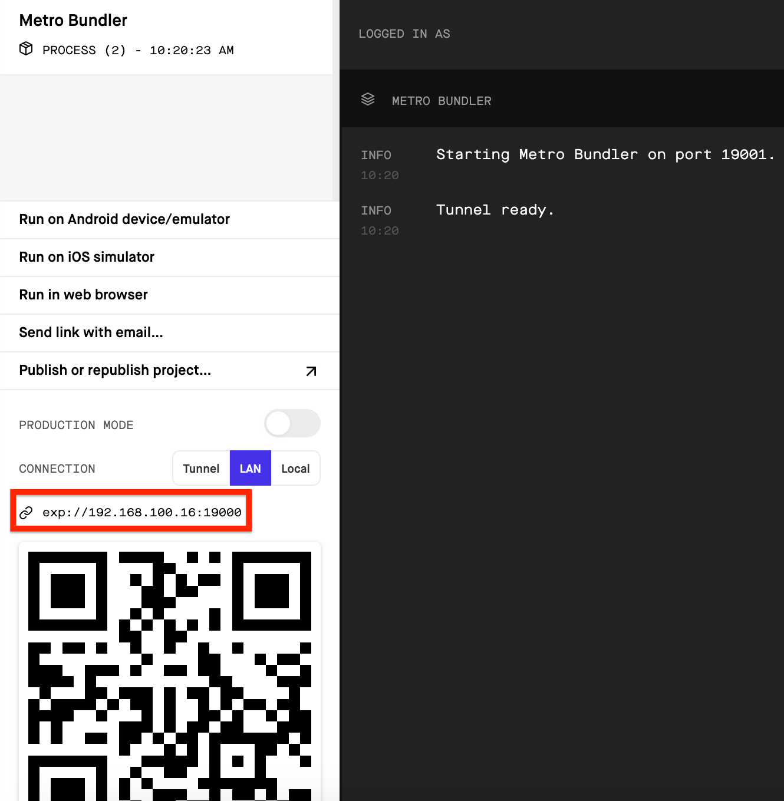
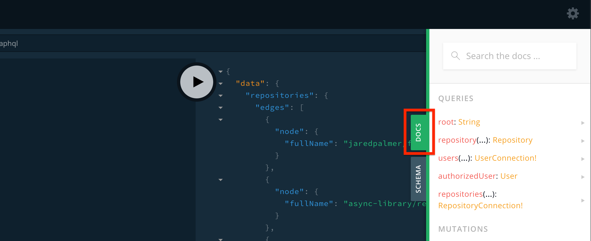
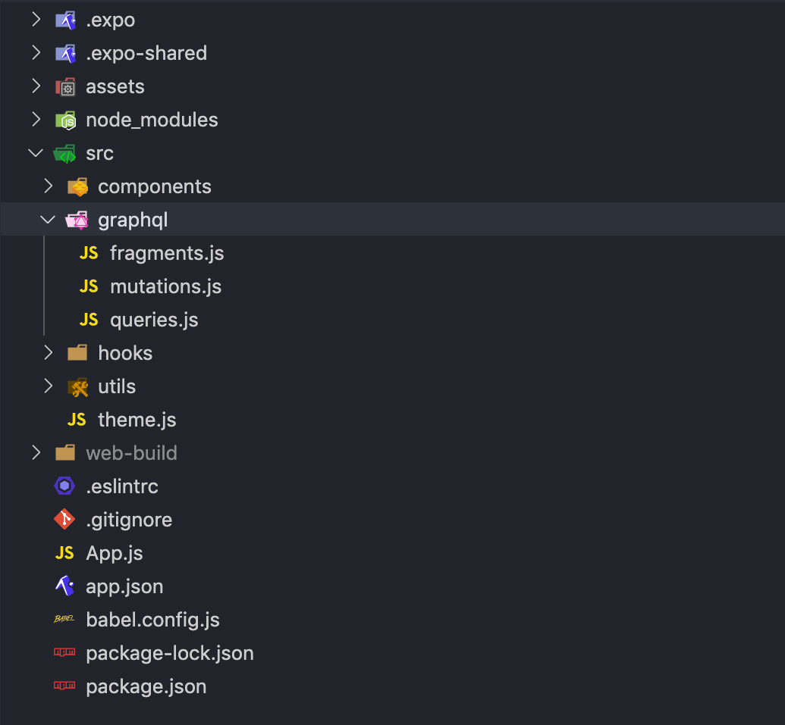

# Communicating with server

So far we have implemented features to our application without any actual server communication. For example, the reviewed repositories list we have implemented uses mock data and the sign in form doesn't send the user's credentials to any authorization endpoint. In this section, we will learn how to communicate with a server using HTTP requests, how to use Apollo Client in a React Native application, and how to store data in the user's device.

Soon we will learn how to communicate with a server in our application. Before we get to that, we need a server to communicate with. For this purpose, we have a completed server implementation in the [rate-repository-api](https://github.com/fullstack-hy2020/rate-repository-api) repository. The rate-repository-api server fulfills all our application's API needs during this part. It uses [SQLite](https://www.sqlite.org/index.html) database which doesn't need any setup and provides an Apollo GraphQL API along with a few REST API endpoints.

Before heading further into the material, set up the rate-repository-api server by following the setup instructions in the repository's [README](https://github.com/fullstack-hy2020/rate-repository-api/blob/master/README.md). Note that if you are using an emulator for development it is recommended to run the server and the emulator _on the same computer_. This eases network requests considerably.

## HTTP requests

React Native provides [Fetch API](https://developer.mozilla.org/en-US/docs/Web/API/Fetch_API) for making HTTP requests in our applications. React Native also supports the good old [XMLHttpRequest API](https://developer.mozilla.org/en-US/docs/Web/API/XMLHttpRequest) which makes it possible to use third-party libraries such as [Axios](https://github.com/axios/axios). These APIs are the same as the ones in the browser environment and they are globally available without the need for an import.

People who have used both Fetch API and XMLHttpRequest API most likely agree that the Fetch API is easier to use and more modern. However, this doesn't mean that XMLHttpRequest API doesn't have its uses. For the sake of simplicity, we will be only using the Fetch API in our examples.

Sending HTTP requests using the Fetch API can be done using the `fetch` function. The first argument of the function is the URL of the resource:

```javascript
fetch('https://my-api.com/get-end-point');
```

The default request method is _GET_. The second argument of the `fetch` function is an options object, which you can use to for example to specify a different request method, request headers, or request body:

```javascript
fetch('https://my-api.com/post-end-point', {
  method: 'POST',
  headers: {
    Accept: 'application/json',
    'Content-Type': 'application/json',
  },
  body: JSON.stringify({
    firstParam: 'firstValue',
    secondParam: 'secondValue',
  }),
});
```

Note that these URLs are made up and won't (most likely) send a response to your requests. In comparison to Axios, the Fetch API operates on a bit lower level. For example, there isn't any request or response body serialization and parsing. This means that you have to for example set the _Content-Type_ header by yourself and use `JSON.stringify` method to serialize the request body.

The `fetch` function returns a promise which resolves a [Response](https://developer.mozilla.org/en-US/docs/Web/API/Response) object. Note that error status codes such as 400 and 500 _are not rejected_ like for example in Axios. In case of a JSON formatted response we can parse the response body using the `Response.json` method:

```javascript
const fetchMovies = async () => {
  const response = await fetch('https://reactnative.dev/movies.json');
  const json = await response.json();

  return json;
};
```

For a more detailed introduction to the Fetch API, read the [Using Fetch](https://developer.mozilla.org/en-US/docs/Web/API/Fetch_API/Using_Fetch) article in the MDN web docs.

Next, let's try the Fetch API in practice. The rate-repository-api server provides an endpoint for returning a paginated list of reviewed repositories. Once the server is running, you should be able to access the endpoint at [http://localhost:5000/api/repositories](http://localhost:5000/api/repositories). The data is paginated in a common [cursor based pagination format](https://graphql.org/learn/pagination/). The actual repository data is behind the _node_ key in the _edges_ array.

Unfortunately, we can't access the server directly in our application by using the _http://localhost:5000/api/repositories_ URL. To make a request to this endpoint in our application we need to access the server using its IP address in its local network. To find out what it is, open the Expo development tools by running `npm start`. In the development tools you should be able to see an URL starting with _exp://_ above the QR code:



Copy the IP address between the _exp://_ and _:_, which is in this example _192.168.100.16_. Construct an URL in format _http://<IP_ADDRESS>:5000/api/repositories_ and open it in the browser. You should see the same response as you did with the _localhost_ URL.

Now that we know the end point's URL let's use the actual server-provided data in our reviewed repositories list. We are currently using mock data stored in the `repositories` variable. Remove the `repositories` variable and replace the usage of the mock data with this piece of code in the _RepositoryList.jsx_ file in the _components_ directory:

```javascript
import React, { useState, useEffect } from 'react';
// ...

const RepositoryList = () => {
  const [repositories, setRepositories] = useState();

  const fetchRepositories = async () => {
    // Replace the IP address part with your own IP address!
    const response = await fetch('http://192.168.100.16:5000/api/repositories');
    const json = await response.json();

    console.log(json);

    setRepositories(json);
  };

  useEffect(() => {
    fetchRepositories();
  }, []);

  // Get the nodes from the edges array
  const repositoryNodes = repositories
    ? repositories.edges.map((edge) => edge.node)
    : [];

  return (
    <FlatList
      data={repositoryNodes}
      // Other props
    />
  );
};

export default RepositoryList;
```

<!-- TODO: Viewing logs linkki -->

We are using the React's `useState` hook to maintain the repository list state and the `useEffect` hook to call the `fetchRepositories` function when the `RepositoryList` component is mounted. We extract the actual repositories into the `repositoryNodes` variable and replace the previously used `repositories` variable in the `FlatList` component's `data` prop with it. Now you should be able to see actual server-provided data in the reviewed repositories list.

It is usually a good idea to log the server's response to be able to inspect it as we did in the `fetchRepositories` function. You should be to see this log message in the Expo development tools if you navigate to your device's logs as we learned in the [Viewing logs]() section. If you are using the Expo's mobile app for development and the network request is failing, make sure that the computer you are using to run the server and your phone are _connected to the same Wi-Fi network_. If that's not possible either use an emulator in the same computer as the server is running in or set up a tunnel to the localhost, for example, using [Ngrok](https://ngrok.com/).

The current data fetching code in the `RepositoryList` component could do some refactoring. For instance, the component is aware of the network request's details such as the end point's URL. In addition, the data fetching code has lots of reuse potential. Let's refactor the component's code by extract the data fetching code into its own hook. Create a directory _hooks_ in the _src_ directory and in that _hooks_ directory create a file _useRepositories.js_ with the following content:

```javascript
import { useState, useEffect } from 'react';

const useRepositories = () => {
  const [repositories, setRepositories] = useState();
  const [loading, setLoading] = useState(false);

  const fetchRepositories = async () => {
    setLoading(true);

    // Replace the IP address part with your own IP address!
    const response = await fetch('http://192.168.100.16:5000/api/repositories');
    const json = await response.json();

    setLoading(false);
    setRepositories(json);
  };

  useEffect(() => {
    fetchRepositories();
  }, []);

  return { repositories, loading, refetch: fetchRepositories };
};

export default useRepositories;
```

Now that we have a clean abstraction for fetching the reviewed repositories, let's use the `useRepositories` hook in the `RepositoryList` component:

```javascript
import React from 'react';

// ...

import useRepositories from '../hooks/useRepositories';

const RepositoryList = () => {
  const { repositories } = useRepositories();

  const repositoryNodes = repositories
    ? repositories.edges.map((edge) => edge.node)
    : [];

  return (
    <FlatList
      data={repositoryNodes}
      // Other props
    />
  );
};

export default RepositoryList;
```

That's it, now the `RepositoryList` component is no longer aware of the way the repositories are acquired. Maybe in the future, we will acquire them through a GraphQL API instead of a REST API. We will see what happens.

## GraphQL and Apollo client

In [part 8](https://fullstackopen.com/en/part8) we learned about GraphQL and how to send GraphQL queries to an Apollo Server using the [Apollo Client](https://www.apollographql.com/docs/react/) in React applications. The good news is that we can use the Apollo Client in a React Native application exactly as we would with a React web application.

As mentioned earlier, the rate-repository-api server provides a GraphQL API which is implemented with Apollo Server. Once the server is running, you can access the [GraphQL Playground](https://www.apollographql.com/docs/apollo-server/testing/graphql-playground/#gatsby-focus-wrapper) at [http://localhost:5000/graphql](http://localhost:5000/graphql). GraphQL Playground is a development tool for making GraphQL queries and inspecting the GraphQL APIs schema and documentation. If you need to send a query in your application _always_ test it with the GraphQL Playground first before implementing it in the code. It is much easier to debug possible problems in the query in the GraphQL Playground than in the application. If you are uncertain what the available queries are or how to use them, click the _docs_ tab to open the documentation:



In our React Native application, we will be using the [Apollo Boost](https://www.npmjs.com/package/apollo-boost) library which is a zero-config way to start using Apollo Client. As a React integration, we will be using the [@apollo/react-hooks](https://www.apollographql.com/docs/react/api/react-hooks/) library, which provides hooks such as [useQuery](https://www.apollographql.com/docs/react/api/react-hooks/#usequery) and [useMutation](https://www.apollographql.com/docs/react/api/react-hooks/#usemutation) for using the Apollo Client. Let's get started by installing the dependencies:

```shell
npm install apollo-boost @apollo/react-hooks graphql
```

Next, let's create a utility function for creating the Apollo Client with the required configuration. Create a _utils_ directory in the _src_ directory and in that _utils_ directory create a file _apolloClient.js_. In that file configure the Apollo Client to connect to the Apollo Server:

```javascript
import ApolloClient from 'apollo-boost';

const createApolloClient = () => {
  return new ApolloClient({
    // Replace the IP address part with your own IP address!
    uri: 'http://192.168.100.16:5000/graphql',
  });
};

export default createApolloClient;
```

The URL used to connect to the Apollo Server is otherwise the same as the one you used with the Fetch API expect the path is _/graphql_. Lastly, we need to provide the Apollo Client using the [ApolloProvider](https://www.apollographql.com/docs/react/api/react-hooks/#apolloprovider) context. We will add it to the `App` component in the _App.js_ file:

```javascript
import React from 'react';
import { NativeRouter } from 'react-router-native';
import { ApolloProvider } from '@apollo/react-hooks';

import Main from './src/components/Main';
import createApolloClient from './utils/apolloClient';

const apolloClient = createApolloClient();

const App = () => {
  return (
    <NativeRouter>
      <ApolloProvider client={apolloClient}>
        <Main />
      </ApolloProvider>
    </NativeRouter>
  );
};

export default App;
```

## Organizing GraphQL related code

It is up to you how to organize the GraphQL related code in your application. However, for the sake of a reference structure, let's have a look at one quite simple and efficient way to organize the GraphQL related code. In this structure, we define queries, mutations, fragments, and possibly other entities in their own files. These files are located in the same directory. Here is an example of the structure you can use to get started:



You can import the [gql](https://www.apollographql.com/docs/apollo-server/api/apollo-server/#gql) template literal tag used to define GraphQL queries from the Apollo Boost library. If we follow the structure suggested above, we could have a _queries.js_ file in the _graphql_ directory for our application's GraphQL queries. Each of the queries can be stored in a variable and exported like this:

```javascript
import { gql } from 'apollo-boost';

export const GET_REPOSITORIES = gql`
  query repositories {
    ${/* ... */}
  }
`;

// other queries...
```

We can import these variables and use them with the `useQuery` hook like this:

```javascript
import { useQuery } from '@apollo/react-hooks';

import { GET_REPOSITORIES } from '../graphql/queries';

const Component = () => {
  const { data, error, loading } = useQuery(GET_REPOSITORIES);
  // ...
};
```

The same goes for organizing mutations. The only difference is that we define them in a different file, _mutations.js_. It is recommended to use [fragments](https://www.apollographql.com/docs/react/data/fragments/) in queries to avoid retyping the same fields over and over again.

## Evolving the structure

Once our application grows larger there might be times when certain files grow too large to manage. For example, we have component `A` which renders the components `B` and `C`. All these components are defined in a file _A.jsx_ in a _components_ directory. We would like to extract components `B` and `C` into their own files _B.jsx_ and _C.jsx_ without major refactors. We have two options:

1. Create files _B.jsx_ and _C.jsx_ in the _components_ directory. This results in the following structure:

```
components/
  A.jsx
  B.jsx
  C.jsx
  ...
```

2. Create a directory _A_ in the _components_ directory and create files _B.jsx_ and _C.jsx_ there. To avoid breaking components that import the _A.jsx_ file, move the _A.jsx_ file to the _A_ directory and rename it to _index.jsx_. This results in the following structure:

```
components/
  A/
    B.jsx
    C.jsx
    index.jsx
  ...
```

The first option is fairly decent, however, if components `B` and `C` are not reusable outside the component `A`, it is useless to bloat the _components_ directory by adding them as separate files. The second option is quite modular and doesn't break any imports because importing a path such as _./A_ will match both _A.jsx_ and _A/index.jsx_.

## Exercise 10.9.

We want to replace the Fetch API implementation in the `useRepositories` hook with a GraphQL query. Open the GraphQL Playground at [http://localhost:5000/graphql](http://localhost:5000/graphql) and open to documentation by clicking the _docs_ tab. Look up the `repositories` query. The query has some arguments, however, all of these are optional so you don't need to specify them. In the GraphQL Playground form a query for fetching the repositories with the fields you are currently displaying in the application. The result will be paginated and it contains the up to first 30 results by default. For now, you can ignore the pagination entirely.

Once the query is working in the GraphQL Playground, use it to replace the Fetch API implementation in the `useRepositories` hook. This can be achieved using the [useQuery](https://www.apollographql.com/docs/react/api/react-hooks/#usequery) hook. The `gql` template literal tag can be imported from the Apollo Boost as instructed earlier. Consider using the structure recommended earlier for the GraphQL related code. To avoid future caching issues, use the _cache-and-network_ [fetch policy](https://www.apollographql.com/docs/react/api/react-apollo/#optionsfetchpolicy) in the query. It can be used with the `useQuery` hook like this:

```javascript
useQuery(MY_QUERY, {
  fetchPolicy: 'cache-and-network',
  // Other options
});
```

The changes in the `useRepositories` hook should not affect the `RepositoryList` component in any way.

## Environment variables

Every application will most likely run in more than one environment. Two obvious candidates for these environments are the development environment and the production environment. Out of these two, the development environment is the one we are running the application right now. Different environments usually have different dependencies, for example, the server we are developing locally might use a local database whereas the server that is deployed to the production environment uses the production database. To make the code environment independent we need to parametrize these dependencies. At the moment we are using one very environment dependant hardcoded value in our application: the URL of the server.

We have previously learned that we can provide running programs with environment variables. These variables can be defined in the command line or using environment configuration files such as _.env_ files and third-party libraries such as _Dotenv_. Unfortunately, React Native doesn't have direct support for environment variables. However, we can access the Expo configuration defined in the _app.json_ file located in the root directory of the project.

The configuration can be accessed by importing the `Constants` variable from the _expo-constants_ module as be have done a few times before. Once imported, the `Constants.manifest` property will contain the configuration. Let's try this by logging `Constants.manifest` in the `App` component:

```javascript
import React from 'react';
import { NativeRouter } from 'react-router-native';
import { ApolloProvider } from '@apollo/react-hooks';
import Constants from 'expo-constants';

import Main from './src/components/Main';
import createApolloClient from './src/utils/apolloClient';

const apolloClient = createApolloClient();

const App = () => {
  console.log(Constants.manifest);

  return (
    <NativeRouter>
      <ApolloProvider client={apolloClient}>
        <Main />
      </ApolloProvider>
    </NativeRouter>
  );
};

export default App;
```

You should now see the configuration in the logs.

The next step is to use the configuration to define environment dependant variables in our application. Let's get started by renaming the _app.json_ file to _app.config.js_. Once the file is renamed, we can use JavaScript inside the configuration file. Change the file contents so that the previous object:

```javascript
{
  "expo": {
    "name": "rate-repository-app",
    // rest of the configuration...
  }
}
```

Is turned into and export, which contains the contents of the `expo` property:

```javascript
export default {
   name: 'rate-repository-app',
   // rest of the configuration...
};
```

Expo has reserved an [extra](https://docs.expo.io/guides/environment-variables/#using-app-manifest-extra) property in the configuration for any application specific configuration. To see how this works, let's add a `env` variable into our application's configuration:

```javascript
export default {
   name: 'rate-repository-app',
   // rest of the configuration...
   extra: {
     env: 'development'
   },
};
```

Restart Expo development tools to apply the changes and you should see that the value of `Constants.manifest` property has changed and now includes the `extra` property with our application-specific configuration.

Because using hard coded configuration is a bit silly, let's use an envinronment variable instead:

```javascript
export default {
   name: 'rate-repository-app',
   // rest of the configuration...
   extra: {
     env: process.env.ENV,
   },
};
```

As we have learned, we can set the value of an environment variable through the command line by defining the variable's name and value before the actual command. As an example, start Expo development tools and set the environment variable `ENV` as `test` like this:

```
EVN=test npm start
```

If you take a look at the logs, you should see that `Constants.manifest` property has changed.

We can also load environment variables from a `.env` file as we have learned in the previous parts. First, we need to install the [Dotenv](https://www.npmjs.com/package/dotenv) library:

```
npm install dotenv
```

Next, just add _.env_ file in the root directory of our project with the following content:

```
ENV=development
```

Finally, import the library in the _app.config.js_ file:

```javascript
import 'dotenv/config';

export default {
   name: 'rate-repository-app',
   // rest of the configuration...
   extra: {
     env: process.env.ENV,
   },
};
```

You need to restart Expo development tools to apply the changes you have made to the _.env_ file.

Note that it is _never_ a good idea to put sensitive data into the application's configuration. The reason for this is that once a user has downloaded your application, they can, at least in theory, reverse engineer your application and figure out the sensitive data you have stored into the code.

## Exercise 10.10.

Instead of the hardcoded Apollo Server's URL, use an environment variable defined in the _.env_ file when initializing the Apollo Client. You can name the variable for example `APOLLO_URI`.

## Storing data in the user's device

There are times when we need to store some persisted pieces of data in the user's device. One such common scenario is storing the user's authentication token so that we can retrieve it even if the user closes and reopens our application. In web development, we have used the browser's `localStorage` object to achieve such functionality. React Native provides similar persistent storage, the [AsyncStorage](https://docs.expo.io/versions/latest/react-native/asyncstorage/).

The API of the `AsyncStorage` is in many ways same as the `localStorage` API. They are both key-value storages with similar methods. The biggest difference between the two is that, as the name implies, the operations of `AsyncStorage` are _asynchronous_.

Because `AsyncStorage` operates with string keys in a global namespace it is a good idea to create a simple abstraction for its operations. This abstraction can be implemented for example using a [class](https://developer.mozilla.org/en-US/docs/Web/JavaScript/Reference/Classes). As an example, we could implement a shopping cart storage for storing the products user wants to buy:

```javascript
import { AsyncStorage } from 'react-native';

class ShoppingCartStorage {
  constructor(namespace = 'shoppingCart') {
    this.namespace = namespace;
  }

  async getProducts() {
    const rawProducts = await AsyncStorage.getItem(
      `${this.namespace}:products`,
    );

    return rawProducts ? JSON.parse(rawProducts) : [];
  }

  async addProduct(productId) {
    const currentProducts = await this.getProducts();
    const newProducts = [...currentProducts, productId];

    await AsyncStorage.setItem(
      `${this.namespace}:products`,
      JSON.stringify(newProducts),
    );
  }

  async clearProducts() {
    await AsyncStorage.removeItem(`${this.namespace}:products`);
  }
}

const doShopping = async () => {
  const shoppinCartA = new ShoppingCartStorage('shoppingCartA');
  const shoppinCartB = new ShoppingCartStorage('shoppingCartB');

  await shoppingCartA.addProduct('chips');
  await shoppingCartA.addProduct('soda');

  await shoppingCartB.addProduct('milk');

  const productsA = await shoppingCartA.getProducts();
  const productsB = await shoppingCartB.getProducts();

  console.log(productsA, productsB);

  await shoppingCartA.clearProducts();
  await shoppingCartB.clearProducts();
};

doShopping();
```

Because `AsyncStorage` keys are global, it is usually a good idea to add a _namespace_ for the keys. In this context, the namespace is just a prefix we provide for the storage abstraction's keys. Using the namespace prevents the storage's keys from colliding with other `AsyncStorage` keys. In this example, the namespace is defined as the constructor's argument and we are using the `namespace:key` format for the keys.

We can add an item to the storage using the [AsyncStorage.setItem](https://github.com/react-native-community/async-storage/blob/master/docs/API.md#setItem) method. The first argument of the method is the item's key and the second argument its value. The value _must be a string_, so we need to serialize non-string values as we did with the `JSON.stringify` method. The [AsyncStorage.getItem](https://github.com/react-native-community/async-storage/blob/master/docs/API.md#getitem) method can be used to get an item from the storage. The argument of the method is the item's key, of which value will be resolved. The [AsyncStorage.removeItem](https://github.com/react-native-community/async-storage/blob/master/docs/API.md#removeitem) method can be used to remove the item with the provided key from the storage.

## Exercises 10.11. - 10.12.

### Exercise 10.11.

The current implementation of the sign in form doesn't do much with the submitted user's credentials. Let's do something about that in this exercise. First, read the rate-repository-api server's [authorization documentation](https://github.com/fullstack-hy2020/rate-repository-api#-authorization) and test the provided queries in the GraphQL Playground. If the database doesn't have any users, you can populate the database with some seed data. Instructions for this can be found in the [getting started](https://github.com/fullstack-hy2020/rate-repository-api#-getting-started) section of the README.

Once you know how the authorization queries are supposed to work, create a file _useSignIn.js_ file in the _hooks_ directory. In that file implement a `useSignIn` hook that sends the `authorize` mutation using the [useMutation](https://www.apollographql.com/docs/react/api/react-hooks/#usemutation) hook. Note that the `authorize` mutation has a _single_ argument called `credentials`, which is of type `AuthorizeInput`. This [input type](https://graphql.org/graphql-js/mutations-and-input-types) contains `username` and `password` fields.

The return value of the hook should be a tuple `[signIn, result]` where `result` is the mutations result as it is returned by the `useMutation` hook and `signIn` a function that runs the mutation with a `{ username, password }` object argument. Hint: don't pass the mutation function to the return value directly. Instead, return a function that calls the mutation function like this:

```javascript
const useSignIn = () => {
  const [mutate, result] = useMutation(/* mutation arguments */);

  const signIn = async ({ username, password }) => {
    // call the mutate function here with the right arguments
  };

  return [signIn, result];
};
```

Once the hook is implemented, use it in the `SignIn` component's `onSubmit` callback for example like this:

```javascript
const SignIn = () => {
  const [signIn] = useSignIn();

  const onSubmit = async (values) => {
    const { username, password } = values;

    try {
      const { data } = await signIn({ username, password });
      console.log(data);
    } catch (e) {
      console.log(e);
    }
  };

  // ...
};
```

This exercise is completed once you can log the user's _authorize_ mutations result after the sign in form has been submitted. The mutation result should contain the user's access token.

### Exercise 10.12.

Now that we can obtain the access token we need to store it. Create a file _authStorage.js_ in the _utils_ directory with the following content:

```javascript
import { AsyncStorage } from 'react-native';

class AuthStorage {
  constructor(namespace = 'auth') {
    this.namespace = namespace;
  }

  getAccessToken() {
    // Get the access token for the storage
  }

  setAccessToken(accessToken) {
    // Add the access token to the storage
  }

  removeAccessToken() {
    // Remove the access token from the storage
  }
}

export default AuthStorage;
```

Next, implement the methods `AuthStorage.getAccessToken`, `AuthStorage.setAccessToken` and `AuthStorage.removeAccessToken`. Use the `namespace` variable to give your keys a namespace like we did in the previous example.

## Enhancing Apollo Client's requests

Now that we have implemented storage for storing the user's access token, it is time to start using it. Initialize the storage in the `App` component:

```javascript
import React from 'react';
import { NativeRouter } from 'react-router-native';
import { ApolloProvider } from '@apollo/react-hooks';

import Main from './src/components/Main';
import createApolloClient from './src/utils/apolloClient';
import AuthStorage from './src/utils/authStorage';

const authStorage = new AuthStorage();
const apolloClient = createApolloClient(authStorage);

const App = () => {
  return (
    <NativeRouter>
      <ApolloProvider client={apolloClient}>
        <Main />
      </ApolloProvider>
    </NativeRouter>
  );
};

export default App;
```

We also provided the storage instance for the `createApolloClient` function as an argument. This is because next, we will send the access token to Apollo Server in each request. The Apollo Server will expect that the access token is present in the _Authorization_ header in the format _Bearer <ACCESS_TOKEN>_. We can enhance the Apollo Client's operation by using the [request](https://www.apollographql.com/docs/react/get-started/#configuration-options) option. Let's send the access token to the Apollo Server in our Apollo Client by modifying the `createApolloClient` function in the _apolloClient.js_ file:

```javascript
const createApolloClient = (authStorage) => {
  return new ApolloClient({
    request: async (operation) => {
      try {
        const accessToken = await authStorage.getAccessToken();

        operation.setContext({
          headers: {
            authorization: accessToken ? `Bearer ${accessToken}` : '',
          },
        });
      } catch (e) {
        console.log(e);
      }
    },
    // uri and other options...
  });
};
```

## Using React Context for dependency injection

The last piece of the sing-in puzzle is to integrate the storage to the `useSignIn` hook. To achieve this the hook must be able to access token storage instance we have initialized in the `App` component. React [Context](https://reactjs.org/docs/context.html) is just the tool we need for the job. Create a directory _contexts_ in the _src_ directory. In that directory create a file _AuthStorageContext.js_ with the following content:

```javascript
import React from 'react';

const AuthStorageContext = React.createContext();

export default AuthStorageContext;
```

Now we can use the `AuthStorageContext.Provider` to provide the storage instance to the descendants of the context. Let's add it to the `App` component:

```javascript
import React from 'react';
import { NativeRouter } from 'react-router-native';
import { ApolloProvider } from '@apollo/react-hooks';

import Main from './src/components/Main';
import createApolloClient from './src/utils/apolloClient';
import AuthStorage from './src/utils/authStorage';
import AuthStorageContext from './src/contexts/AuthStorageContext';

const authStorage = new AuthStorage();
const apolloClient = createApolloClient(authStorage);

const App = () => {
  return (
    <NativeRouter>
      <ApolloProvider client={apolloClient}>
        <AuthStorageContext.Provider value={authStorage}>
          <Main />
        </AuthStorageContext.Provider>
      </ApolloProvider>
    </NativeRouter>
  );
};

export default App;
```

Accessing the storage instance in the `useSignIn` hook is now possible using the React's [useContext](https://reactjs.org/docs/hooks-reference.html#usecontext) hook like this:

```javascript
import { useContext } from 'React';
// ...

import AuthStorageContext from '../contexts/AuthStorageContext';

const useSignIn = () => {
  const authStorage = useContext(AuthStorageContext);
  // ...
};
```

Note that accessing a context's value using the `useContext` hook only works if the `useContext` hook is used in a component that is a _descendant_ of the [Context.Provider](https://reactjs.org/docs/context.html#contextprovider) component.

## Exercises 10.13. - 10.14.

### Exercise 10.13.

Improve the `useSignIn` hook so that it stores the user's access token retrieved from the _authorize_ mutation. The return value of the hook should not change. The only change you should make to the `SignIn` component is that you should redirect the user to the reviewed repositories list view after a successful sign in. You can achieve this by using the [https://reacttraining.com/react-router/native/api/Hooks/usehistory] hook and the history's [push](https://reacttraining.com/react-router/native/api/history) method.

After the _authorize_ mutation has been executed and you have stored the user's access token to the storage, you should reset the Apollo Client's store. This will clear the Apollo Client's cache and re-execute all active queries. You can do this by using the Apollo Client's [resetStore](https://www.apollographql.com/docs/react/v2.5/api/apollo-client/#ApolloClient.resetStore) method. You can access the Apollo Client in the `useSignIn` hook using the [useApolloClient](https://www.apollographql.com/docs/react/api/react-hooks/#useapolloclient) hook. Note that the order of the execution is crucial and should be the following:

```javascript
const { data } = await mutate(/* options */);
await authStorage.setAccessToken(/* access token from the data */);
apolloClient.resetStore();
```

### Exercise 10.14.

The final step in completing the sign in feature is to implement a sign out feature. The `authorizedUser` query can be used to check the authorized user's information. If the query's result is `null`, that means that the user is not authorized. Open the GraphQL playground and run the following query:

```javascript
{
  authorizedUser {
    id
    username
  }
}
```

You will probably end up with the `null` result. This is because the GraphQL Playground is not authorized, meaning that it doesn't send a valid access token with the request. Revise the [authorization documentation](https://github.com/fullstack-hy2020/rate-repository-api#-authorization) and retrieve an access token using the `authorize` mutation. Use this access token in the _Authorization_ header as instructed in the documentation. Now, run the `authorizedUser` query again and you should be able to see the authorized user's information.

Open the `AppBar` component in the _AppBar.jsx_ file where you currently have the tabs "Repositories" and "Sign in". Change the tabs so that if the user is signed in the tab "Sign out" is displayed, otherwise show the "Sign in" tab. You can achieve this by using the `authorizedUser` query with the [useQuery](https://www.apollographql.com/docs/react/api/react-hooks/#usequery) hook.

Pressing the "Sign out" tab should remove the user's access token from the storage and reset the Apollo Client's store with the [resetStore](https://www.apollographql.com/docs/react/v2.5/api/apollo-client/#ApolloClient.resetStore) method. Calling the `resetStore` method should automatically re-execute all active queries which means that the `authorizedUser` query should be re-executed. Note that the order of execution is crucial: access token must be removed from the storage _before_ the Apollo Client's store is reset.
