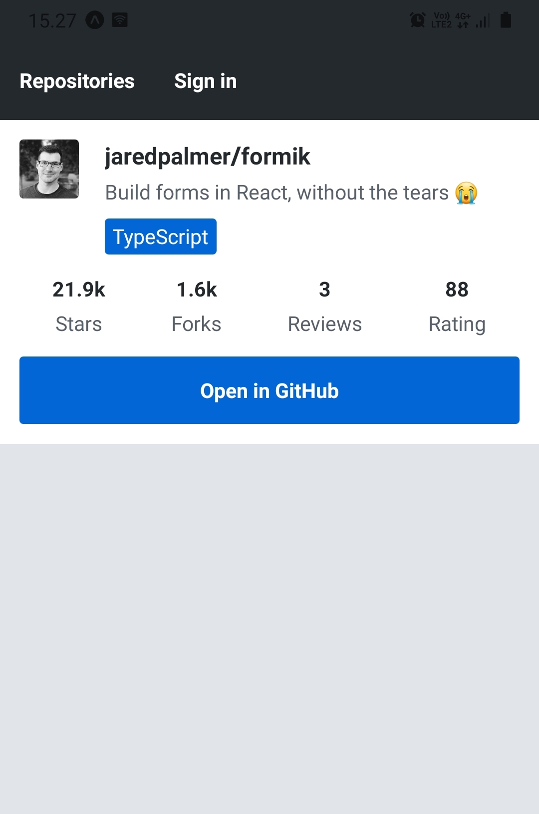
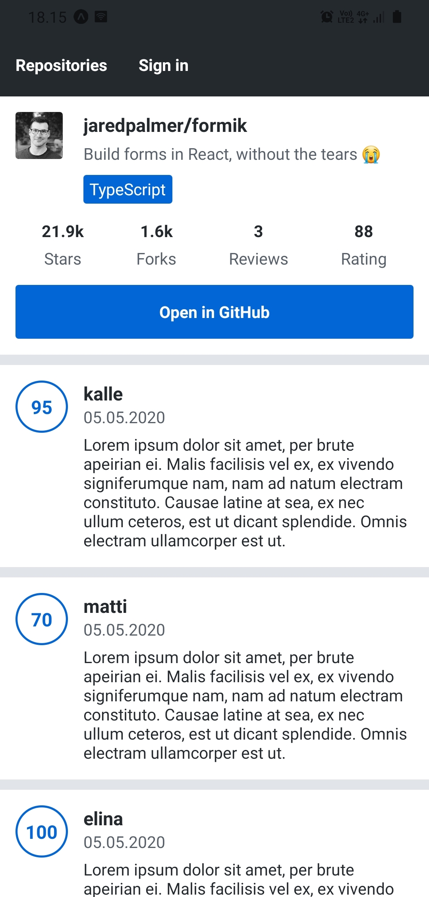
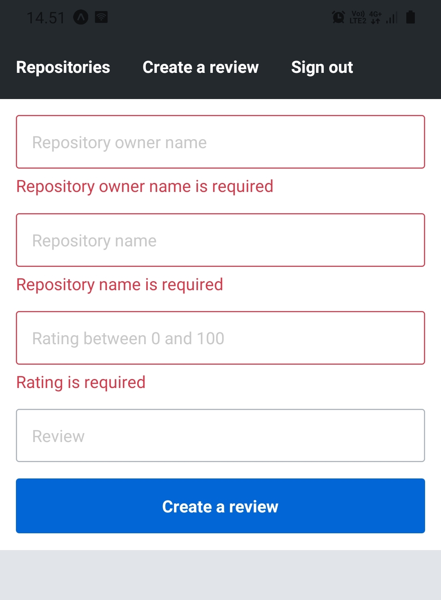
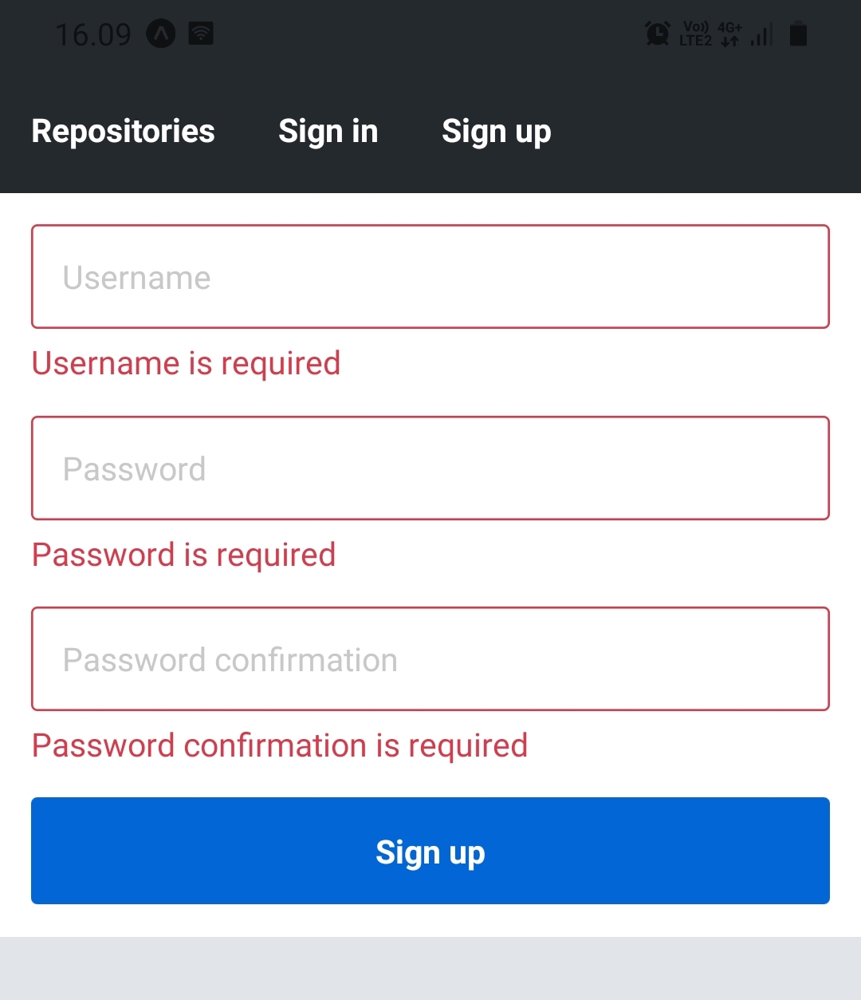
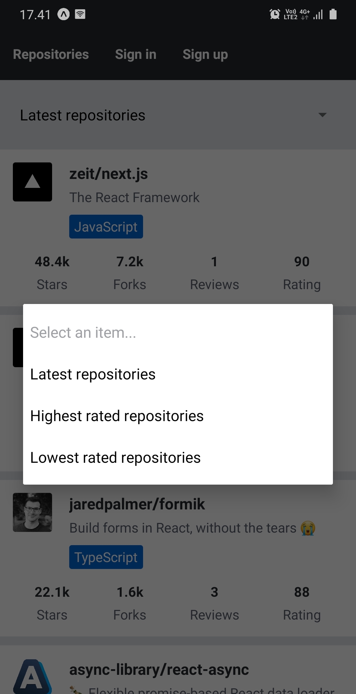

# Testing and extending our application

Now that we have established a good foundation for our project, it is time to start expanding it. In this section you can put to use all the React Native knowledge you have gained so far. Along with expanding our application we will cover some new areas, such as testing, and additional resources.

## Testing React Native applications

To start testing code of any kind, the first thing we need is a testing framework, which we can use to run a set of test cases and inspect their results. For testing a JavaScript application, [Jest](https://jestjs.io/) is a popular candidate for such testing framework. For testing an Expo based React Native application with Jest, Expo provides a set of Jest configuration in a form of [jest-expo](https://github.com/expo/expo/tree/master/packages/jest-expo) preset. In order to use Eslint in the Jest's test files, we also need the [eslint-plugin-jest](https://www.npmjs.com/package/eslint-plugin-jest) plugin for Eslint. Let's get started by installing the packages:

```shell
npm install --save-dev jest jest-expo eslint-plugin-jest
```

To use the jest-expo preset in Jest, we need to add the following Jest configuration to the _package.json_ file along with the _test_ script:

```javascript
{
  // ...
  "scripts": {
    //...
    "test": "jest"
  },
  "jest": {
    "preset": "jest-expo",
    "transform": {
      "^.+\\.jsx?$": "babel-jest"
    },
    "transformIgnorePatterns": [
      "node_modules/(?!(jest-)?react-native|react-clone-referenced-element|@react-native-community|expo(nent)?|@expo(nent)?/.*|react-navigation|@react-navigation/.*|@unimodules/.*|unimodules|sentry-expo|native-base|@sentry/.*|react-router-native)"
    ],
  }
}
```

To use the eslint-plugin-jest plugin in Eslint, we need to include it in the _.eslintrc_ file:

```javascript
{
  "plugins": ["react", "jest"],
  "extends": ["eslint:recommended", "plugin:react/recommended", "plugin:jest/recommended"],
  "parser": "babel-eslint",
  "env": {
    "browser": true
  },
  "rules": {
    "react/prop-types": "off"
  }
}
```

To see that the setup is working, create a directory <i>\_\_tests\_\_</i> in the _src_ directory and in the created directory create a file _example.js_. In that file, add this simple test:

```javascript
describe('Example', () => {
  it('works', () => {
    expect(1).toBe(1);
  });
});
```

Now, let's run our example test by running `npm test`. The command's output should indicate that the test located in the `src/__tests__/example.js` file is passed.

Organizing test files in a single <i>\_\_tests\_\_</i> directory is one approach in organizing the tests. When choosing this approach, it is recommended to put the test files in their corresponding subdirectories just like the code itself. This means that for example tests related to components are in the _components_ directory, tests related to utilities are in the _utils_ directory, and so on. This will result in the following structure:

```
src/
  __tests__/
  components/
    AppBar.js
    RepositoryList.js
    ...
  utils/
    authStorage.js
    ...
  ...
```

Another approach is to organize the tests near the implementation. This means that for example, the test file containing tests for the `AppBar` component is in the same directory as the component's code. This will result in the following structure:

```
src/
  components/
    AppBar/
      AppBar.test.jsx
      index.jsx
    ...
  ...
```

In this example, the component's code is in the _index.jsx_ file and the test in the _AppBar.test.jsx_ file. Note that in order to Jest finding your test files you either have to put them into a <i>\_\_tests\_\_</i> directory, use the _.test_ or _.spec_ suffix, or [manually configure](https://jestjs.io/docs/en/configuration#testmatch-arraystring) the glob patterns.

## Testing components

Now that we have managed to set up Jest and run a very simple test, it is time to find out how to test components. As we know, testing components requires a way to serialize a component's render output and simulate firing different kind of events, such as pressing a button. For these purposes, there is the [Testing Library](https://testing-library.com/docs/intro) family, which provides libraries for testing user interface components in different platforms. All of these libraries share similar API for testing user interface components in a user-centric way.

In [part 5](/en/part5/testing_react_apps) we got familiar with one of these libraries, the [React Testing Library](https://testing-library.com/docs/react-testing-library/intro). Unfortunately, this library is only suitable for testing React web applications. Luckily, there exists a React Native counterpart for this library, which is the [Native Testing Library](https://testing-library.com/docs/native-testing-library/intro). This is the library we will be using while testing our React Native application's components. The good news is, that these libraries share a very similar API, so there aren't too many new concepts to learn. In addition to the Native Testing Library, we need a set of React Native specific Jest matchers such as `toHaveTextContent` and `toHaveProp`. These matchers are provided by the [jest-native](https://github.com/testing-library/jest-native) library. Before getting into the details, let's install these packages:

```shell
npm install --save-dev @testing-library/react-native @testing-library/jest-native
```

To be able to use these matchers we need to extend the Jest's `expect` object. This can be done by using a global setup file. Create a file _setupTests.js_ in the root directory of your project, that is, the same directory where the _package.json_ file is located. In that file add the following line:

```javascript
import '@testing-library/jest-native/extend-expect';
```

Next, configure this file as a setup file in the Jest's configuration in the _package.json_ file (note that the `<rootDir>` in the path is intentional and there is no need to replace it):

```javascript
{
  // ...
  "jest": {
    "preset": "jest-expo",
    "transform": {
      "^.+\\.jsx?$": "babel-jest"
    },
    "transformIgnorePatterns": [
      "node_modules/(?!(jest-)?react-native|react-clone-referenced-element|@react-native-community|expo(nent)?|@expo(nent)?/.*|react-navigation|@react-navigation/.*|@unimodules/.*|unimodules|sentry-expo|native-base|@sentry/.*|react-router-native)"
    ],
    "setupFilesAfterEnv": ["<rootDir>/setupTests.js"]
  }
  // ...
}
```

The main concepts of the Native Testing Library are the [queries](https://www.native-testing-library.com/docs/api-queries) and [firing events](https://www.native-testing-library.com/docs/api-events). Queries are used to extract a set of nodes from the component that is rendered using the [render](https://www.native-testing-library.com/docs/api-main#render-options) function. Queries are useful in tests where we except for example some text, such as the name of a repository, to be present in the rendered component. To get hold of specific nodes easily, it is recommended to tag nodes with the `testID` prop, and query it with the [getByTestId](https://www.native-testing-library.com/docs/api-queries#bytestid) function. Every React Native core component accepts the `testID` prop. Here is an example of how to use the queries:

```javascript
import React from 'react';
import { Text, View } from 'react-native';
import { render } from '@testing-library/react-native';

const Greeting = ({ name }) => {
  return (
    <View>
      {/* This node is tagged with the testID prop */}
      <Text testID="greetingText">Hello {name}!</Text>
    </View>
  );
};

describe('Greeting', () => {
  it('renders a greeting message based on the name prop', () => {
    const { debug, getByTestId } = render(<Greeting name="Kalle" />);

    debug();

    expect(getByTestId('greetingText')).toHaveTextContent('Hello Kalle!');
  });
});
```

The `render` function returns the queries and additional helpers, such as the `debug` function. The [debug](https://www.native-testing-library.com/docs/api-main#debug) function prints the rendered React tree in a user-friendly format. Use it if you are unsure what the React tree rendered by the `render` function looks like. We acquire the `Text` node tagged with the `testID` prop by using the `getBytestId` function. For all available queries, check the Native Testing Library's [documentation]. The `toHaveTextContent` matcher is used to assert that the node's textual content is correct. The full list of available React Native specific matchers can be found in the [documentation](https://github.com/testing-library/jest-native#matchers) of the jest-native library. Jest's [documentation](https://jestjs.io/docs/en/expect) contains every universal Jest matcher.

The second very important Native Testing Library concept is firing events. We can fire an event in a provided node by using the [fireEvent](https://www.native-testing-library.com/docs/api-events) object's methods. This is useful for example typing text into a text field or pressing a button. Here is an example of how to test submitting a simple form:

```javascript
import React, { useState } from 'react';
import { Text, TextInput, TouchableWithoutFeedback, View } from 'react-native';
import { render, fireEvent } from '@testing-library/react-native';

const Form = ({ onSubmit }) => {
  const [username, setUsername] = useState('');
  const [password, setPassword] = useState('');

  const handleSubmit = () => {
    onSubmit({ username, password });
  };

  return (
    <View>
      <View>
        <TextInput
          value={username}
          onChangeText={(text) => setUsername(text)}
          placeholder="Username"
          testID="usernameField"
        />
      </View>
      <View>
        <TextInput
          value={password}
          onChangeText={(text) => setPassword(text)}
          placeholder="Password"
          testID="passwordField"
        />
      </View>
      <View>
        <TouchableWithoutFeedback onPress={handleSubmit} testID="submitButton">
          <Text>Submit</Text>
        </TouchableWithoutFeedback>
      </View>
    </View>
  );
};

describe('Form', () => {
  it('calls function provided by onSubmit prop after pressing the submit button', () => {
    const onSubmit = jest.fn();
    const { getByTestId } = render(<Form onSubmit={onSubmit} />);

    fireEvent.changeText(getByTestId('usernameField'), 'kalle');
    fireEvent.changeText(getByTestId('passwordField'), 'password');
    fireEvent.press(getByTestId('submitButton'));

    expect(onSubmit).toHaveBeenCalledTimes(1);

    // onSubmit.mock.calls[0][0] contains the first argument of the first call
    expect(onSubmit.mock.calls[0][0]).toEqual({
      username: 'kalle',
      password: 'password',
    });
  });
});
```

In this test, we want to test that after filling the form's fields using the `fireEvent.changeText` method and pressing the submit button using the `fireEvent.press` method, the `onSubmit` callback function is called correctly. To inspect whether the `onSubmit` function is called and with which arguments, we can use a [mock function](https://jestjs.io/docs/en/mock-function-api). Mock functions are functions with preprogrammed behavior such as a specific return value. In addition, we can create expectations for the mock functions such as "expect the mock function to have been called once". The full list of available expectations can be found in the Jest's [expect documentation](https://jestjs.io/docs/en/expect).

Before heading further into the world of testing React Native applications, play around with these examples by adding a test file in the <i>\_\_tests\_\_</i> directory we created earlier.

## Handling dependencies in tests

Components in the previous examples are quite easy to test because they are more or less _pure_. Pure components don't depend on _side effects_ such as network requests or using some native API such as the AsyncStorage. The `Form` component is much less pure than the `Greeting` component because its state changes can be counted as a side effect. Nevertheless, testing it isn't too difficult.

Next, let's have a look at a strategy for testing components with side effects. Let's pick the `RepositoryList` component from our application as an example. At the moment the component has one side effect, which is a GraphQL query for fetching the reviewed repositories. The current implementation of the `RepositoryList` component looks something like this:

```javascript
const RepositoryList = () => {
  const { repositories } = useRepositories();

  const repositoryNodes = repositories
    ? repositories.edges.map((edge) => edge.node)
    : [];

  return (
    <FlatList
      data={repositoryNodes}
      // ...
    />
  );
};

export default RepositoryList;
```

The only side effect is the use of the `useRepositories` hook, which sends a GraphQL query. There are a few ways to test this component. One way is to mock the Apollo Client's responses as instructed in the Apollo Client's [documentation](https://www.apollographql.com/docs/react/development-testing/testing/). A more simple way is to assume that the `useRepositories` hook works as intended (preferably through testing it) and extract the components "pure" code into another component, such as the `RepositoryListContainer` component:

```javascript
export const RepositoryListContainer = ({ repositories }) => {
  const repositoryNodes = repositories
    ? repositories.edges.map((edge) => edge.node)
    : [];

  return (
    <FlatList
      data={repositoryNodes}
      // ...
    />
  );
};

const RepositoryList = () => {
  const { repositories } = useRepositories();

  return <RepositoryListContainer repositories={repositories} />;
};

export default RepositoryList;
```

Now, the `RepositoryList` component contains only the side effects and its implementation is quite simple. We can test the `RepositoListContainer` component by providing it with paginated repository data through the `repositories` prop and checking that the rendered content has the correct information. This can be achieved by tagging the required `RepositoryItem` component's nodes with `testID` props.

## Exercises

### Exercise

Implement a test that ensures that the `RepositoryListContainer` component renders repository's name, description, language, forks count, stargazers count, rating average, and review count correctly. Remember that you can use the [toHaveTextContent](https://github.com/testing-library/jest-native#tohavetextcontent) matcher to check whether a node has certain textual content. You can use the [getAllByTestId](https://www.native-testing-library.com/docs/api-queries#getallby) query to get all nodes with a certain `testID` prop as an array. If you are unsure what is being rendered, use the [debug](https://www.native-testing-library.com/docs/next/api-main#debug) function to see the serialized rendering result.

Use this as a base for your test:

```javascript
describe('RepositoryList', () => {
  describe('RepositoryListContainer', () => {
    it('renders repository information correctly', () => {
      const repositories = {
        pageInfo: {
          totalCount: 8,
          hasNextPage: true,
          endCursor:
            'WyJhc3luYy1saWJyYXJ5LnJlYWN0LWFzeW5jIiwxNTg4NjU2NzUwMDc2XQ==',
          startCursor: 'WyJqYXJlZHBhbG1lci5mb3JtaWsiLDE1ODg2NjAzNTAwNzZd',
        },
        edges: [
          {
            node: {
              id: 'jaredpalmer.formik',
              fullName: 'jaredpalmer/formik',
              description: 'Build forms in React, without the tears',
              language: 'TypeScript',
              forksCount: 1619,
              stargazersCount: 21856,
              ratingAverage: 88,
              reviewCount: 3,
              ownerAvatarUrl:
                'https://avatars2.githubusercontent.com/u/4060187?v=4',
            },
            cursor: 'WyJqYXJlZHBhbG1lci5mb3JtaWsiLDE1ODg2NjAzNTAwNzZd',
          },
          {
            node: {
              id: 'async-library.react-async',
              fullName: 'async-library/react-async',
              description: 'Flexible promise-based React data loader',
              language: 'JavaScript',
              forksCount: 69,
              stargazersCount: 1760,
              ratingAverage: 72,
              reviewCount: 3,
              ownerAvatarUrl:
                'https://avatars1.githubusercontent.com/u/54310907?v=4',
            },
            cursor:
              'WyJhc3luYy1saWJyYXJ5LnJlYWN0LWFzeW5jIiwxNTg4NjU2NzUwMDc2XQ==',
          },
        ],
      };

      // Add your test code here
    });
  });
});
```

You can put the test file where you please. However, it is recommended to follow one of the ways of organizing test files introduced earlier. Use the `repositories` variable as the repository data for the test. There should be no need to alter the variable's value. Note that the repository data contains two repositories, which means that you need to check that both repositories' information is present.

### Exercise

Implement a test that ensures that filling the sing in form's username and password fields and pressing the submit button _will call_ the `onSubmit` handler with _correct arguments_. The _first argument_ of the handler should be an object representing the form's values. You can ignore the other arguments of the function. Remember that the [fireEvent](https://www.native-testing-library.com/docs/api-events) methods can be used for triggering events and a [mock function](https://jestjs.io/docs/en/mock-function-api) for checking whether the `onSubmit` handler is called or not.

You don't have to test any Apollo Client or AsyncStorage related code which is in the `useSignIn` hook. As in the previous exercise, extract the pure code into its own component and test it in the test. Here's an example of how this can be achieved:

```javascript
export const SignInContainer = ({ onSubmit }) => {
  return (
    <Formik
      initialValues={initialValues}
      onSubmit={onSubmit}
      validationSchema={validationSchema}
    >
      {({ handleSubmit }) => <SignInForm onSubmit={handleSubmit} />}
    </Formik>
  );
};

const SignIn = () => {
  const [signIn] = useSignIn();
  const history = useHistory();

  const onSubmit = async (values) => {
    // ...
  };

  return <SignInContainer onSubmit={onSubmit} />;
};

export default SignIn;
```

Now you can import the `SignInContainer` component in the test file and use it in the test. As in the previous exercise, you can choose how to organize the test files.

Note that Formik's form submissions are _asynchronous_ so expecting the `onSubmit` function to be called immediately after pressing the submit button won't work. You can get around this issue by making the test function an async function using the `async` keyword and using the Native Testing Library's [wait](https://www.native-testing-library.com/docs/next/api-async#wait) helper function. The `wait` function can be used to wait for expectations to pass. Here is a rough example of how to use it:

```javascript
import React from 'react';
import { render, fireEvent, wait } from '@testing-library/react-native';
// ...

describe('SignIn', () => {
  describe('SignInContainer', () => {
    it('calls onSubmit function with correct arguments when a valid form is submitted', async () => {
      // render the SignInContainer component, fill the text inputs and press the submit button

      await wait(() => {
        // expect the onSubmit function to have been called once and with a correct first argument
      });
    });
  });
});
```

You might face the following warning messages: `Warning: An update to Formik inside a test was not wrapped in act(...)`. This happens because `fireEvent` method calls cause asynchronous calls in Formik's internal logic. You can get rid of these messages by wrapping each of the `fireEvent` method calls with the [act](https://www.native-testing-library.com/docs/next/api-main#act) function like this:

```javascript
await act(async () => {
  // call the fireEvent method here
});
```

## Additional resources

As we are getting closer to the end of this part, let's take a moment to look at some additional React Native related resources. [Awesome React Native](https://github.com/jondot/awesome-react-native) is an extremely encompassing curated list of React Native resources such as libraries, tutorials, and articles. Because the list is exhaustively long, let's have a closer look at few of its highlights

### React Native Paper

> Paper is a collection of customizable and production-ready components for React Native, following Google’s Material Design guidelines.

[React Native Paper](https://callstack.github.io/react-native-paper/) is for React Native what [Material-UI](https://material-ui.com/) is for React web applications. It offers a wide range of high-quality UI components and support for [custom themes](https://callstack.github.io/react-native-paper/theming.html). [Setting up](https://callstack.github.io/react-native-paper/getting-started.html) React Native Paper for Expo based React Native applications is quite simple, which makes it possible to use it in the upcoming exercises if want to give it a go.

### Styled-components

> Utilising tagged template literals (a recent addition to JavaScript) and the power of CSS, styled-components allows you to write actual CSS code to style your components. It also removes the mapping between components and styles – using components as a low-level styling construct could not be easier!

[Styled-components] is a library for styling React components using [CSS-in-JS](https://en.wikipedia.org/wiki/CSS-in-JS) technique. In React Native we are already used to defining component's styles as a JavaScript object, so CSS-in-JS not so uncharted territory. However, the approach of styled-components is quite different from using the `StyleSheet.create` method and the `style` prop.

In styled-components component's styles are defined with the component using a feature called [tagged template literal](https://developer.mozilla.org/en-US/docs/Web/JavaScript/Reference/Template_literals#Tagged_templates) or a plain JavaScript object. Styled-components makes it possible to define new style properties for component based on its props _at runtime_. This brings many possibilities, such as seamlessly switching between a light and a dark theme. It also has a full [theming support](https://styled-components.com/docs/advanced#theming). Here is an example of creating a `Text` component with style variations based on props:

```javascript
import React from 'react';
import styled from 'styled-components/native';
import { css } from 'styled-components';

const FancyText = styled.Text`
  color: grey;
  font-size: 14px;

  ${({ isBlue }) =>
    isBlue &&
    css`
      color: blue;
    `}

  ${({ isBig }) =>
    isBig &&
    css`
      font-size: 24px;
      font-weight: 700;
    `}
`;

const Main = () => {
  return (
    <>
      <FancyText>Simple text</FancyText>
      <FancyText isBlue>Blue text</FancyText>
      <FancyText isBig>Big text</FancyText>
      <FancyText isBig isBlue>
        Big blue text
      </FancyText>
    </>
  );
};
```

Because styled-components processes the style definitions, it is possible to use CSS-like snake case syntax with the property names and units in property values. However, units don't have any effect because property values are internally unitless. For more information on styled-components, head out to the [documentation](https://styled-components.com/docs).

## Extending our application

It is time to put everything we have learned so far to a good use and start extending our application. Our application still lacks a few important features such as reviewing a repository and registering a user. The upcoming exercises will focus on these essential features. Feel free to use any additional resources, such as React Native Paper's components, while working on the exercises. However, using additional resources is entirely _optional_ and you should focus on completing the minimum requirements of the exercises before working on improvements.

## Exercises

### Exercise

Implement a view for a single repository, which contains the same repository information as in the reviewed repositories list but also a button for opening the repository in GitHub. It would be good idea to reuse the `RepositoryItem` component used in the `RepositoryList` component, and display the GitHub repository button for example based on a boolean prop.

Repository's URL is in the `url` field of the `Repository` type in the GraphQL schema. You can fetch a single repository from the Apollo server with the `repository` query. The query has a single argument, which is the id of the repository. Here's a simple example of the `repository` query:

```javascript
{
  repository(id: "jaredpalmer.formik") {
    id
    fullName
    url
  }
}
```

As always, test your queries in the GraphQL playground first before using them in your application. If you are unsure about the GraphQL schema or what are the available queries, open either the _docs_ or _schema_ tab in the GraphQL playground. If you have trouble using the id as a variable in the query, take a moment to study the Apollo Client's [documentation](https://www.apollographql.com/docs/react/data/queries/) on queries. 

To learn how to open a URL in a browser, read the Expo's [Linking API documentation](https://docs.expo.io/workflow/linking/). You will need this feature while implementing the button for opening the repository in GitHub.

The view should have its own route. It would be a good idea to define repository's id in the route's path as path paramter, which you can access by using the [useParams](https://reacttraining.com/react-router/native/api/Hooks/useparams) hook. Hser should be able to access the view by pressing a repository in the reviewed repositories list. You can achieve this by for example wrapping the `RepositoryItem` with a [TouchableOpacity](https://reactnative.dev/docs/touchableopacity) component in the `RepositoryList` component and using `history.push` method to change the route in a `onPress` event handler. You can access the `history` object with the [useHistory](https://reacttraining.com/react-router/native/api/Hooks/usehistory) hook.

The final version of the single repository view should look something like this:



### Exercise

Now that we have a view for a single repository, let's display repository's reviews there. Repository's reviews are in the `reviews` field of the `Repository` type in the GraphQL schema. `reviews` is a similar paginated list as in the `repositories` query. Here's an example of getting reviews of a repository:

```javascript
{
  repository(id: "jaredpalmer.formik") {
    id
    fullName
    reviews {
      edges {
        node {
          id
          text
          rating
          createdAt
          user {
            id
            username
          }
        }
      }
    }
  }
}
```

Review's `text` field contains the textual review, `rating` field a numeric rating between 0 and 100 and `createdAt` the date when the review was created. Review's `user` field contains the reviewer's information, which is of type `User`.

We want to display reviews as a scrollable list, which makes [FlatList](https://reactnative.dev/docs/flatlist) a suitable component for the job. To display the previous exercise's repository's information in the top of the list, you can use the `FlatList` components [ListHeaderComponent](https://reactnative.dev/docs/flatlist#listheadercomponent) prop. You can use the [ItemSeparatorComponent](https://reactnative.dev/docs/flatlist#itemseparatorcomponent) to add some space between the items like in the `RepositoryList` component. Here's an example of the structure:

```javascript
const RepositoryInfo = ({ repository }) => {
  // Repository's information implemented in the previous exercise
};

const ReviewItem = ({ review }) => {
  // Single review item
};

const SingleRepository = () => {
  // ...

  return (
    <FlatList
      data={reviews}
      renderItem={({ item }) => <ReviewItem review={item} />}
      keyExtractor={({ id }) => id}
      ListHeaderComponent={() => <RepositoryInfo repository={repository} />}
      // ...
    />
  );
};

export default SingleRepository;
```

The final version of the repository's reviews list should look something like this:



The date under the reviewer's username is the creation date of the review, which is in the `createdAt` field of the `Review` type. The date format should be user-friendly such as _date.month.year_. You can for example install the [date-fns](https://date-fns.org/) library and use the [format](https://date-fns.org/v2.13.0/docs/format) function for formatting the creation date.

The round shape of the rating's container can be achieved with the `borderRadius` style property. You can make it round by fixing the container's `width` and `height` style property and setting the border radius as `width / 2`.

### Exercise

Implement a form for creating a review using Formik. The form should have four fields: repository owner's GitHub username (for example "jaredpalmer"), repository's name (for example "formik"), a numeric rating, and a textual review. Validate the fields using Yup schema so that it contains the following validations:

- Repository owner's username is a required string
- Repository's name is a required string
- Rating is a required number between 0 and 100
- Review is a optional string

Explore the Yup's [documentation](https://github.com/jquense/yup#yup) to find suitable validators. Use sensible error messages with the validators. The validation message can be defined as the validator method's `message` argument. You can make the review field expand to multiple lines by using `TextInput` component's [multiline](https://reactnative.dev/docs/textinput#multiline) prop.

You can create a review using the `createReview` mutation. Check this mutation's arguments in the _docs_ tab in the GraphQL playground. You can use the [useMutation](https://www.apollographql.com/docs/react/api/react-hooks/#usemutation) hook to send a mutation to the Apollo Server.

After a successful `createReview` mutation, redirect user to the repository's view you implemented in the previous exercise. This can be done with the `history.push` method after you have obtained the history object using the [useHistory](https://reacttraining.com/react-router/native/api/Hooks/usehistory) hook. The created review has a `repositoryId` field which you can use to construct the route's path.

To prevent getting cached data with the `repository` query in the single repository view, use the _cache-and-network_ [fetch policy](https://www.apollographql.com/docs/react/api/react-apollo/#optionsfetchpolicy) in the query. It can be used with the `useQuery` hook like this:

```javascript
useQuery(GET_REPOSITORY, {
  fetchPolicy: 'cache-and-network',
  // Other options
});
```

Note that only _an existing public GitHub repository_ can be reviewed and user can review the same repository _only once_. You don't have to handle these error cases, but the error payload includes specific codes and messages for these errors. You can try out your implementation by reviewing one of your own public repositories or any other public repository.

The review form should be accessible through the app bar. Create a tab to the app bar with a label "Create a review". This tab should only be visible to users who have signed in. You will also need to define a route for the review form.

The final version of the review form should look something like this:



This screenshot has been taken after an invalid form submission to present what the form should look like in an invalid state.

### Exercise

Implement a sign up form for registering a user using Formik. The form should have three fields: username, password and password confirmation. Validate the form using Yup schema so that it contains the following validations:

- Username is a required string with a length between 1 and 30
- Password is a required string with a length between 5 and 50
- Password confirmation matches the password

Password confirmation field's validation can be a bit tricky, but it can be done for example by using the [oneOf](https://github.com/jquense/yup#mixedoneofarrayofvalues-arrayany-message-string--function-schema-alias-equals) and [ref](https://github.com/jquense/yup#yuprefpath-string-options--contextprefix-string--ref) methods like suggested in [this issue](https://github.com/jaredpalmer/formik/issues/90#issuecomment-354873201).

You can create a new user by using the `createUser` mutation. Find out how this mutations work by exploring the documentation in the GraphQL playground. After a succesful `createUser` mutation, sign the created user in by using the `useSignIn` hook like we did in the sign in the form. After user has been signed in, redirect the user to the reviewed repositories list view.

User should be able to access the sign up form through the app bar by pressing a "Sign up" tab. This tab should only be visible to users that aren't signed in.

The final version of the sign up form should look something like this:



This screenshot has been taken after an invalid form submission to present what the form should look like in an invalid state.

### Exercise

At the moment repositories in the reviewed repositories list are ordered by the date of repository's first review. Implement a feature that allows users to select the principle, which is used to order the repositories. The available ordering principles should be:

- Latest repositories. Repository with the latest first review is on the top of the list. This is the current behavior and should be the default principle.
- Highest rated repositories. Repository with the _highest_ average rating is on the top of the list.
- Lowest rated repositories. Repository with the _lowest_ average rating is on the top of the list.

The `repositories` query used to fetch the reviewed repositories has a argument called `orderBy`, which you can use to define the ordering principle. The argument has two allowed values: `CREATED_AT` (order by the date of repository's first review) and `RATING_AVERAGE`, (order by the repository's average rating). The query also has an argument called `orderDirection` which can be used to change the order direction. The argument has two allowed values: `ASC` (ascending, smallest value first) and `DESC` (descending, biggest value first).

You can use for example [react-native-picker](https://www.npmjs.com/package/react-native-picker-select) library, or React Native Paper's [Menu](https://callstack.github.io/react-native-paper/menu.html) component to implement the ordering principle's selection. You can use the `FlatList` component's [ListHeaderComponent](https://reactnative.dev/docs/flatlist#listheadercomponent) prop to provide the list a header containing the selection component.

The final version of the feature, depending on the selection component in use, should look something like this:



### Exercise

- Repository list filtering (optional)

## Infinite scrolling

- https://reactnative.dev/docs/flatlist
- https://www.apollographql.com/docs/react/data/pagination/#cursor-based
- Example of adding infinite scrolling to the repository list

## Exercises

- Repository review list infinite scrolling